[][involves]

<table width="100%">
  <tr>
  <td width="50%">
  
  </td>
  <td width="50%">
    

      InfoSec | Risk Analysis | Standards
    

    

      
      
      
      <!-- <a href="" rel="nofollow"> -->
        
      <!-- </a> -->
      <!-- <a href="" rel="nofollow"> -->
        
      <!-- </a> -->
      
      
      <!-- <a href="" rel="nofollow"> -->
        
      <!-- </a> -->
    

  </td>
</table>

<!--  -->

## 🖊️ 📖

⠿ 🪬 Hi, call me _**Neveda°**_  
⠿ ⚡️ **Interested in**: _documentation, standards and safe programming_  
⠿ 🌱 **Learning**: _Cybersec, Active Directory, C, Rust, Python, Go, Powershell_  
⠿ 🚀 **Looking to collaborate on**: _testing, documentation, standards_  
⠿ 💬 **Ask me anything about**: _UNIX shells, POSIX, LaTeX_  
⠿ ✉️ **Contact**: <mnrvwl@protonmail.com>  
⠿ 🪞 **Mirrors**: [@carbon-vault](https://github.com/carbon-vault)  

###### ⠿ 📟 **Formerly**: [@mnrvwl](https://github.com/onmv) [2020-2023] [@omnv]() [2023]

## 📈 📊

[][involves]

[involves]: https://github.com/search?q=involves%3ANeved4&type=issues

<!-- 
 -->

<!--

-->

  
<h2>📍 🪬</h2>

### ⌨️ 🌎

### 📑 📌 Extra Pins

